```{r setup, include=FALSE, cache=FALSE}
# TO render: rmarkdown::render('Lesson2.Rmd', 'xaringan::moon_reader')

# set working directory to docs folder
setwd(here::here())

# Set global R options
options(htmltools.dir.version = FALSE, servr.daemon = TRUE)

# Set global knitr chunk options
knitr::opts_chunk$set(
  fig.align = "center", 
  cache = TRUE,
  error = FALSE,
  message = FALSE, 
  warning = FALSE, 
  collapse = TRUE 
)

# This is good for getting the ggplot background consistent with
# the html background color
library(ggplot2)
thm <- theme_bw()
theme_set(thm)

library(RefManageR)
BibOptions(check.entries = FALSE,
           bib.style = "authoryear",
           cite.style = "authoryear",
           style = "markdown",
           hyperlink = FALSE,
           max.names = 2,
           dashed = FALSE)
bib <- ReadBib("biblio/bib.bib", check = FALSE)
```

```{r xaringanExtra, echo=FALSE}
library(xaringanExtra)
use_tile_view() 
```

class: title-slide


# .font170[MICROBIOMA E MICROBIOTA]


<br><br><br><br>
.marco[
.tada[Marco Chiapello]
<br>
2021-10-27
]


.marco[
.center[.font90[[[`r fontawesome::fa("slack", fill = "steelblue")`](https://join.slack.com/t/ipma-2020/shared_invite/zt-j9o8ig7k-LN1~U3d6QJztquYbC6iW7w) Slack (https://bit.ly/3upNjCt) - `r fontawesome::fa("envelope", fill = "steelblue")`](mailto:marco.chiapello@unito.it) marco.chiapello@unito.it]
]
]

???

.n30[

]

---


layout: true

# Recap


---

```{r echo=FALSE, out.width = "400px"}

```

.m0tbp[
.center[https://bit.ly/3CfqmFj]
]


---
layout: true
# Can the plant modify the composition of the associated microbiota?

---

class: inverse, middle, center 

----

---
layout: true
# Plants modify the composition of microbiota

---

```{r echo=FALSE, out.width="900px"}
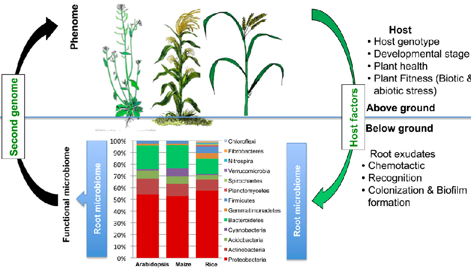
```
.right[.font50[`r Cite(bib, key = "Lakshmanan_2014")`]]

---

.pull-left[

**Plant sensing and the initiation of colonization**

.h202o[
.m0ul[

1. Plants reliese exudates

  - **Plant exudates**: complex mixtures of soluble organic substances that are secreted by living plants

1. Plant-associated microorganisms use **chemotaxis** to sense and respond to plant-derived signals

1. Once a signal is perceived, **microorganisms move towards the plant** with the use of flagella

1. Microorganisms attach to the root surface and form a **biofilm**

1. Genes that encode proteins involved in bacterial chemotaxis, flagella assembly, bacterial motility and biofilm formation are **highly abundant in the rhizosphere compared with the bulk soil**

]
]
]

.pull-right[
<br>
```{r echo=FALSE, out.width="700px"}
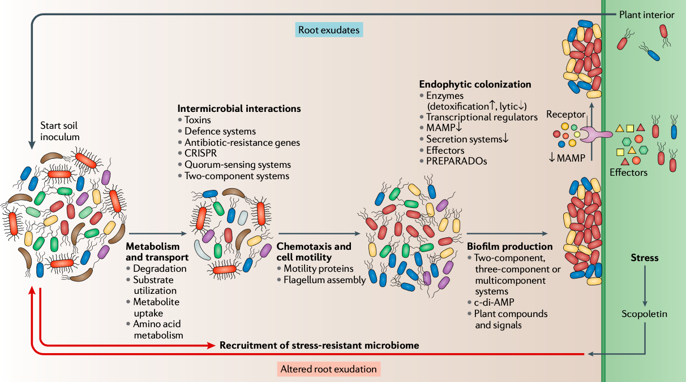
```
.right[.font50[`r Cite(bib, key = "Trivedi:2020aa")`]]

]

???

.h202[
- Vediamo come le piante attirano i microorganismi che formeranno il loro microbiota

  1. Le piante rilasciano essudati (ovvero un complesso mix di sostanze organiche)
  1. I microorganismi percepiscono queste sostanze e rispondono ai segnali della pianta muovendosi verso la radice
  1. Una volta raggiunta la pianta costituiscono un biofilm sulla superficie della radice

- Molto interessante è l'elevata concetrazione di protein batteriche presenti nel suolo legare alla chemotassi, ai flagelli alla mobilità e alla formazione del biofilm nella rizosfera in confronto a quelle che è possibile trovare nel bulk soil
]


---

.pull-left[
**How plant can recruit beneficial microbes** 
.m0tp[
.h202[

- `r fontawesome::fa("lightbulb", fill = "#FAAD18")` The plant-associated **microbiota is shaped** by complex interactions among the plant, microorganisms and the environment

- `r fontawesome::fa("exclamation-circle", fill = "green")` Metabolic diversification of root exudates within the plant kingdom may provide a basis for communication and recognition that directs the **assembly and maintenance** of a distinct microbiota tailored to the needs of the host

- Plant in response to local environments can **recruit distinct plant-associated microbial communities**

]
]
]

.pull-right[
<br>
```{r echo=FALSE, out.width="500px"}
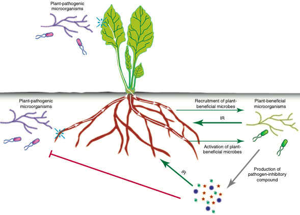
```
.right[.font50[`r Cite(bib, key = "Berendsen")`]]
]

???

.h202[
- Come avrete capito il microbiata è formato e si forma tramite complesse interazioni tra pianta e microorganismi e microorganismi stessi

- Ma ci siamo detti più volte che la forza che da forma al microbiota è la pianta

- Si ritiene infatti che gli essudati radicali di diverse piante siano alla base della cominucazione tra la pianta e i microorganismi che formeranno il suo microbiota. Microbiota che la pianta cerca di cucirsi su misura in modo che risponda alle sue esigenze

- Le esigenze della pianta possono cambiare a seconda delle condizioni in cui si trova (stress salino, attacco di patogeni) e una modificazione degli essudati potrebbe essere alla base di un reclutamento specifico

- VEDIAMO UN ESEMPIO
]

---

.pull-left[
**How plant can recruit beneficial microbes** 
.m0tp[
.h202[


- `r fontawesome::fa("bullseye", fill = "red")` Demonstration that roots selectively secrete Malic acid and effectively signal beneficial rhizobacteria establishes a regulatory role of root metabolites in recruitment of beneficial microbes

- `r fontawesome::fa("flask", fill = "grey")` Aerial infection with *Pseudomonas syringae* strains Pst DC3000 **correlate with changes in root symbiont colonization** (*Bacillus subtilis* strain FB17) implicated root exudate involvement in the beneficial microbe recruitment
]
]
]

.pull-right[
<br>
```{r echo=FALSE, out.width="500px"}
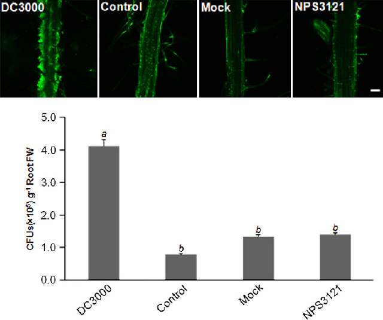
```
.right[.font50[`r Cite(bib, key = "Rudrappa_2008")`]]
]

???

.h202[
- Vediamo come la secrezione di acido malico serva per il reclutamento di uno specifico batterio che della rizospera che aiuta la pianta a proteggersi da un'infezione area di Pseudomonas syrigae

- Il grafico e l'immagine mostrano la presenza di FB17 a livello radicale quando è in atto un'infezione di P. syrigae a livello fogliare

- (NPS3121) nonpathogenic *Pseudomonas syringae* 

- L'infezione fogliare CORRELA con l'aumento della colonizzazione dei FB17
]

---

.pull-left[
**How plant can recruit beneficial microbes** 
.m0tp[
.h202[


- `r fontawesome::fa("question-circle", fill = "red")` Can leaf infection trigger changes in the composition of root metabolites?

]
]
]

.pull-right[
<br>
```{r echo=FALSE, out.width="500px"}

```

.font70[[Spurious correlation](https://www.tylervigen.com/spurious-correlations)]
]

???

.h202[
- L'infezione fogliare causa il cambiamento nella composizione degli essudati radicali?
]

---

.pull-left[
**How plant can recruit beneficial microbes** 
.m0tp[
.h202[


- `r fontawesome::fa("question-circle", fill = "red")` Can leaf infection trigger changes in the composition of root metabolites?

- `r fontawesome::fa("flask", fill = "grey")` Root secretions from plants subjected to different aerial bacterial infection treatments were collected and chemically analyzed by HPLC

- `r fontawesome::fa("flask", fill = "grey")` The peak was characterized by liquid chromatography-mass spectrometry and determined to be **malic acid**

<br><br>
.right[.font50[`r Cite(bib, key = "Rudrappa_2008")`]]
]
]
]

.pull-right[
```{r echo=FALSE, out.width="280px"}
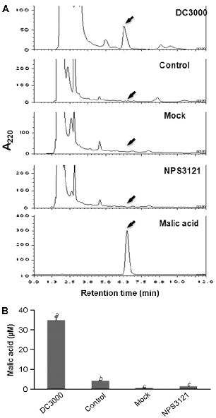
```
]

.h202[
- La risposta è SI

- Guardiamo la figura per capire come abbiamo fatto i ricercatori per capire quale fosse il composto che variava
]

---

.pull-left[
**How plant can recruit beneficial microbes** 
.m0tp[
.h202[


- `r fontawesome::fa("question-circle", fill = "red")` Is the malic acid able to selectively recruit the symbiont colonization (*Bacillus subtilis* strain FB17)?

- *B. subtilis*  exhibits positive chemotaxis towards Malic Acid

- L-MA specifically chemoattracts FB17

- None of the tested bacteria shows any significant motility toward L-MA compared to *B. subtilis* 

<br><br>
.right[.font50[`r Cite(bib, key = "Rudrappa_2008")`]]
]
]
]

.pull-right[
```{r echo=FALSE, out.width="300px"}
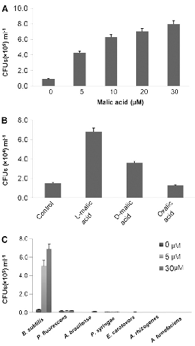
```
]


???

.h202[
- È l'acido malico il composto reposnsabile del reclutamento di B. subtilis FB17?

- La risposta è nuovamente SI

- Descrizione della figura
]

---

.pull-left[
**How plant can recruit beneficial microbes** 
.m0tp[
.h202[


- `r fontawesome::fa("question-circle", fill = "red")` Does MA transporter mutant fails to recruit *B. subtilis* onto the root surface?

- `r fontawesome::fa("flask", fill = "grey")` Arabidopsis knockout mutant *Atalmt1*  **deficient in root MA secretion** was assayed to confirm the role of MA secretions in recruiting FB17

- `r fontawesome::fa("flask", fill = "grey")` *Atalmt1* x *Ler*-0 line **restored wild-type Col-0 phenotype** under Pst DC3000 infection

<br><br>
.right[.font50[`r Cite(bib, key = "Rudrappa_2008")`]]
]
]
]

.pull-right[
```{r echo=FALSE, out.width="600px"}
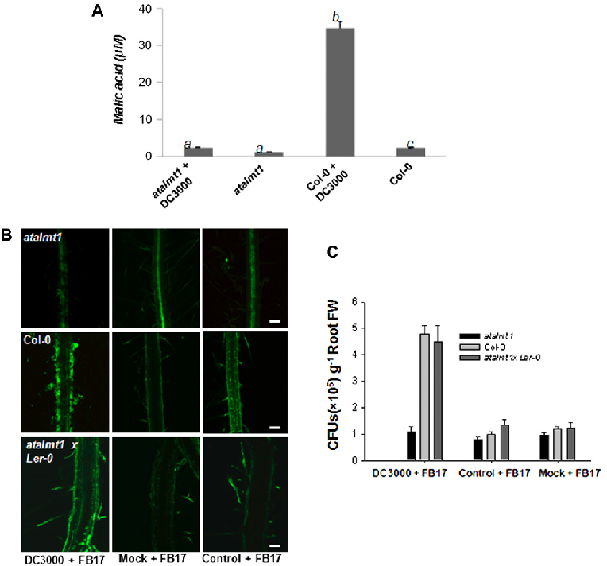
```
]

???

.h202[
- Cosa succede se impediamo la secrezione di acodi malico da parte della pianta?

- Creato un mutante deficiente per la secrezione di acido malico (Atalmt1)

- FB17 non viene più attirato
]

---

.pull-left[
**Dynamics of the plant-associated microbiome** 
.m0tp[
.h202[

- `r fontawesome::fa("bullseye", fill = "red")` The assembly of a plant-associated microbiome is a **successional, multistep process** that is determined by dispersal, species interactions, the environment and the host

- **Early colonizers** could be **transmitted vertically** `r fontawesome::fa("arrows-alt-v", fill = "#2F4659")` , via the parents, through seed transmission pathways

- Once **seeds germinate**, microbiome assembly is likely to be driven by **horizontal transfer** `r fontawesome::fa("arrows-alt-h", fill = "#2F4659")`:
  - seed-borne microorganisms preferentially become associated with aboveground plant tissues
  - soil-derived microorganisms are mainly associated with the rhizosphere and roots

]
]
]

.pull-right[
<br>
```{r echo=FALSE, out.width="480px"}
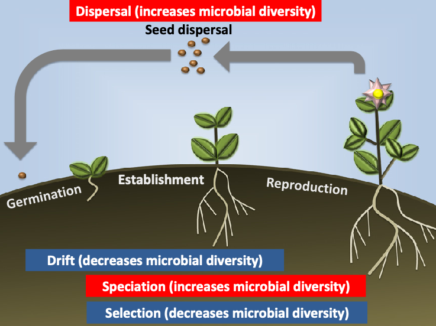
```
]

???

.h202[
- Continuiamo a vedere la dinamica del reclutamento del microbiota da parte della pianta

- I colonizzatori precoci sono trasmessi in senso verticale, cioè per via parentale tramite i semi e si associeranno preferibilmente alla parte epigea della pianta

- Una volta che la pianta si sviluppa il microbiota viene reclutato in modo orizzontale 
]
---

.pull-left[
**Dynamics of the plant-associated microbiome** 
.m0tp[
.h202[

- Microbiomes is **highly dynamic** in the early vegetative phase `r fontawesome::fa("seedling", fill = "#25403B")`, begins to **converge** throughout vegetative growth `r fontawesome::fa("pagelines", fill = "#25403B")` and **stabilizes** during the reproductive phase `r fontawesome::fa("fan", fill = "#F23D4C")` 

- A small fraction of microbial taxa belonging to the **core microbiota** are consistently maintained throughout plant development

- Specific traits (drought tolerance, disease resistance) that are conferred by associations with a particular microbial group can be **passed from mother plants to offspring** `r fontawesome::fa("arrows-alt-v", fill = "#2F4659")`
]
]
]

.pull-right[
<br>
```{r echo=FALSE, out.width="480px"}

```
]

???

.h202[
- Il microbiota è altamente dimanico nelle fasi iniziale della vita della pianta, converge durante la fase di crescita vegetativa e si stabilizza durante la fase riproduttiva.

- Alcuni tratti specifici del microbiota che conferiscono vantaggi ecologici alla pianta vengono passati dalla pianta madre alle future generazioni.
]

---

.center[**Evolutionary Relationship of PGPB and Pathogenic Bacteria**]
```{r echo=FALSE, out.width="480px"}
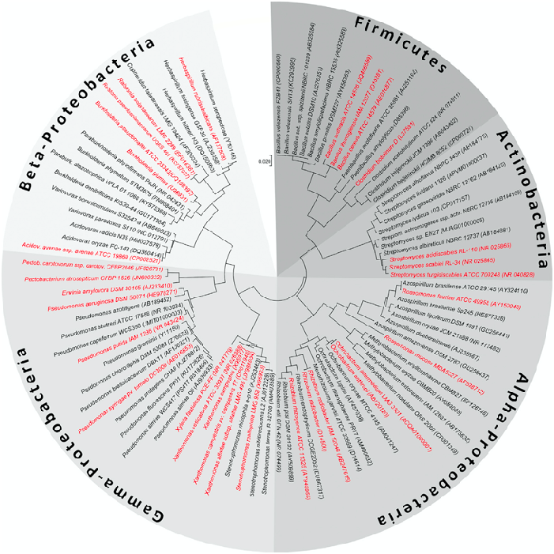
```
.right[.font50[`r Cite(bib, key = "BERENDSEN2012478")`]]

???
.h202[
- Un piccolo commento prima di cambiare capitolo.

- Non pensiate esistano phylum di batteri benefici e phylum di batteri patogeni.

- Come mostrato da questo albero filogenetico spesso lo stesso genere puà avere specie diverse che hanno effetti contrapposti.
]

---

layout: true
# Can we exploit the microbiota?

---

class: inverse, middle, center 

----

---

.center[**Inoculation of microbial consortium**]

.pull-left[
.m0tbp[
.h24[

- Microorganisms have long been applied as inoculants for biocontrol or biostimulation

.center[BUT]

- their field efficacy varies with the climate, soil type and other environmental factors
]
]
]

.pull-right[
<br>
```{r echo=FALSE, out.width="600px"}
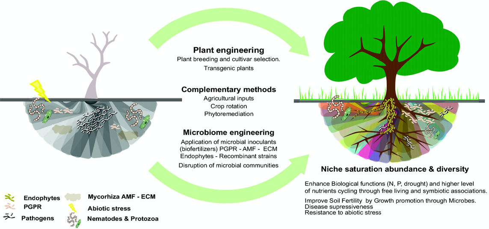
```
.right[.font50[`r Cite(bib, key = "Quiza_2015")`]]
]   

---

.center[**Outcomes of inoculation with a microbial consortium**]

.pull-left[
.m0tbp[
.h20[

- **Outcomes of inoculating** with a five-member consortium in the presence of a diverse environmental microbial pool 

- Three cultivars are depicted growing in **three different regimes**: a normal year, a drought year, and low-input management

- **Genotype effects**:
  - In a normal year, Cultivar A is colonized by all five members of the inoculant consortium
  - Cultivar B is colonized only by yellow spheres
  - Cultivar C is colonized only by teal stars

- **Environment/ management effects**:
  - The drought year shows higher colonization by blue ovals 
  - Under low-input management all cultivars show increased colonization by the green spiky ovals

- **Temporal dynamics** of two communities after a disturbance event:
  - The more resilient community recovers to its initial state after perturbation
  - The less resilient community does not recovers to its initial state after perturbation
]
]
]

.pull-right[
```{r echo=FALSE, out.width="490px"}
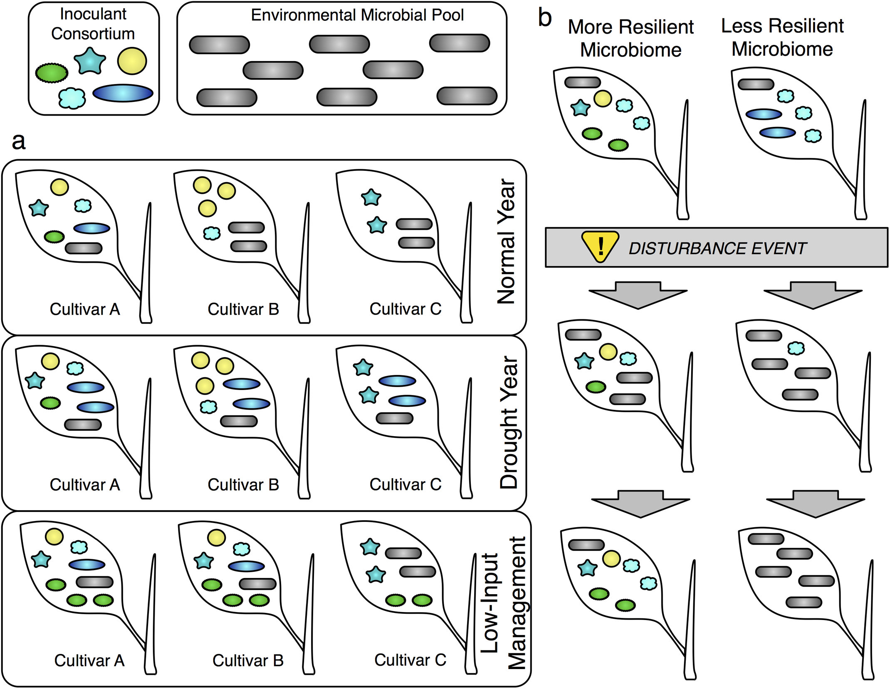
```
.right[.font50[`r Cite(bib, key = "Posy2017", .opts = list(max.names=2))`]]
]
---

.center[**Microbiome engineering using synthetic microbial communities**]

.pull-left[
.m0tp[
.h204[

- `r fontawesome::fa("exclamation-triangle", fill = "red")` There is NOT  a "one size fits all" microorganism community"

- `r fontawesome::fa("lightbulb", fill = "#F2B544")` Synthetic microbial communities (synComs) of varied complexity have been constructed using bottom-up combinations 

- To build a synCom selection of core functions are more important than taxonomical selection 

- synComs with different complexities can be designed through predictive modelling that evaluates trait redundancy, dominance, modularity, interactions and assembly
]
]
]

.pull-rigth[
<br>
```{r echo=FALSE, out.width="500px"}
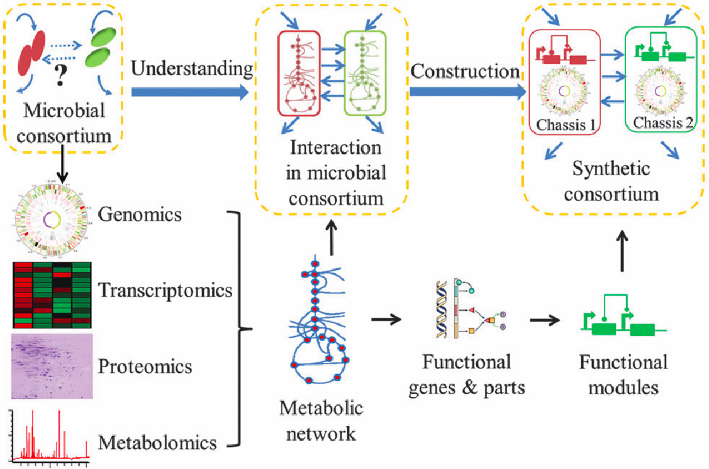
```
.right[.font50[`r Cite(bib, key = "C4CS00114A")`]]
]

---
class: clear, middle, center

# .black[Companies Examples]

----

---

.center[
```{r echo=FALSE, out.width="500px"}

```
<br>
BioConsortia Inc. is devoted to developing solutions through **enhanced crop productivity** and
is aware that **microbial products have a major role** to play in future mainstream agricultural crops

<br>
.marco[.tada[https://bioconsortia.com/]]
]

---


background-image: url(images/bioc2.png)
background-size: cover

.content-box-grey2[
.p20[
**Founded in New Zeland in 1994**

The company specializes in the discovery and development of natural microbial products
]
]
<br>
.content-box-grey2[
.p20[
**Breakthrough in Advanced Microbial Selection (AMS) process in 2009**

Focused on perfecting the innovative R&D platform for AMS
]
]
<br>
.content-box-grey2[
.p20[**In 2014, the decision was made to globalize**

BioConsortia raised $15 million from Khosla Ventures and Otter Capital, and establishing the headquarters and labs in Davis, CA
]
]
<br>
.content-box-grey2[
.p20[**Strong R&D Experise**

30 highly experienced experts from industry and academia, including 12 PhDs
]
]
<br>
.content-box-grey2[
.p20[**Highest level of competency in ultra-high-throughput biological screening**

They now hold one of the world’s largest collections of pre-screened and characterized microorganisms, comprising over 45,000 microbes, including 9,000 endophytes
]]

---

```{r echo=FALSE, out.width="850px"}
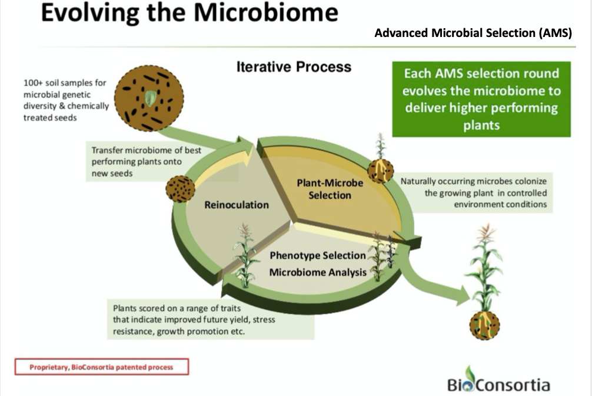
```

---

```{r echo=FALSE, out.width="850px"}
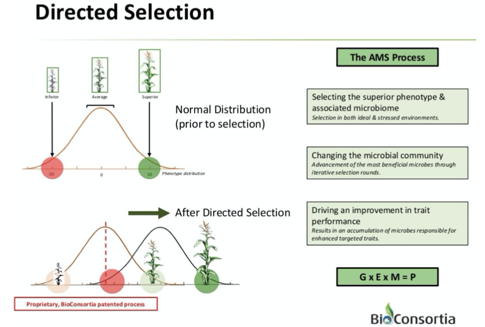
```

???

.n30[
- Genetics x Envirinment x Microbiome = Phenotype
]

---

```{r echo=FALSE, out.width="850px"}
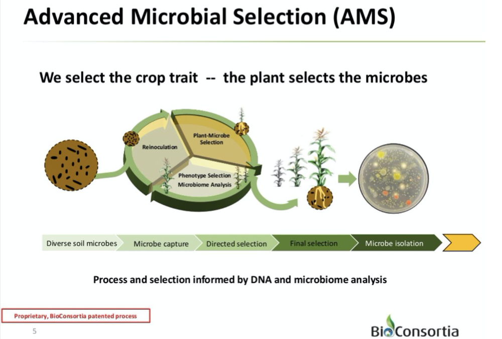
```

---

```{r echo=FALSE, out.width="850px"}
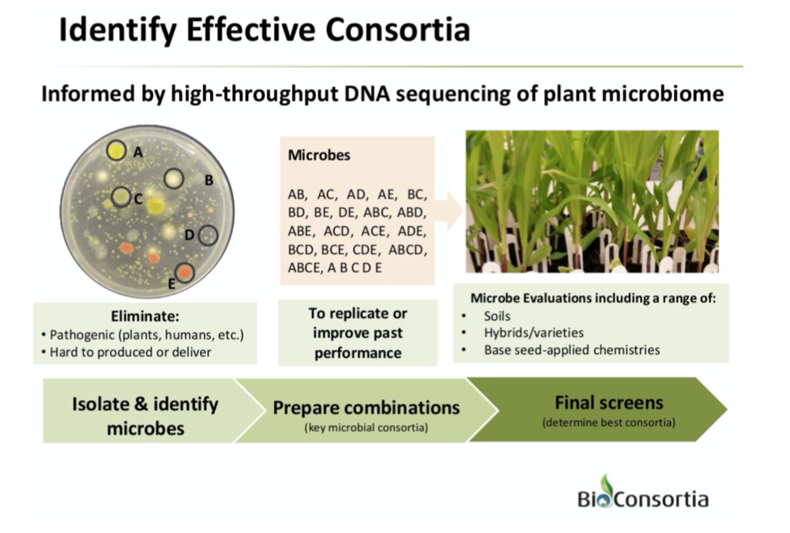
```

---

```{r echo=FALSE, out.width="850px"}
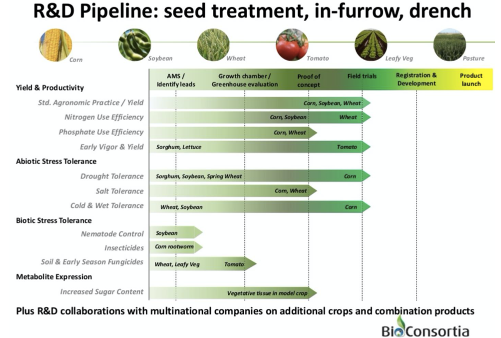
```
---

```{r echo=FALSE, out.width="850px"}
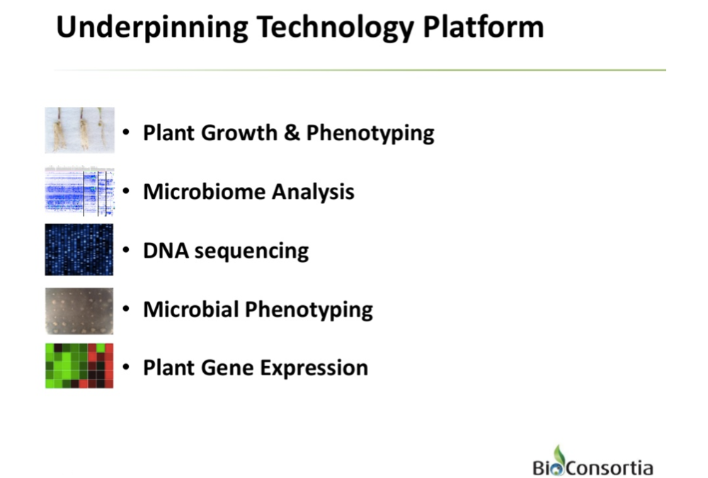
```

---

.center[
```{r echo=FALSE, out.width="400px"}

```

<br>
At Mycorrhizal Applications, we harness the power and wisdom of natural systems to promote living soils and increase quality, productivity, and health in all industries involving soils, plants, and people


.marco[.tada[https://mycorrhizae.com/]]
]

---

background-image: url(images/ma2.png)
background-size: cover

.content-box-grey3[
.p201[
**Founded in  USA**<br>
Mycorrhizal Applications was established in the Dr. Amaranthuses’ garage,
with a focus on producing ectomycorrhizal slurries for use in forest restoration
]
]
<br>
.content-box-grey3[
.p201[
**Large-scale production in 2002**<br>
The company moved to its first large-scale production and office building 
]
]
<br>
.content-box-grey3[
.p201[
**Entered into the agriculture industry in 2004**<br>
Its MycoApply® Micronized Endo product being utilized as a seed coat, kick starting the next growth phase for the company
]
]
<br>
.content-box-grey3[
.p201[
**Products for international markets in 2016**<br>
New highly-concentrated MycoApply® products for the Agriculture markets and non-Agriculture sectors like Horticulture, Nurseries and Turf Management
]
]
<br>
.content-box-grey3[
.p201[
**Development and launch of new formulations in 2020**<br>
New advanced carrier technology for agriculture and for horticulture and turf
]
]
<br>

---

.pull-left[
```{r echo=FALSE, out.width="450px"}

```
]

.pull-right[
```{r echo=FALSE, out.width="450px"}

```
]

---

.center[
```{r echo=FALSE, out.width="900px"}
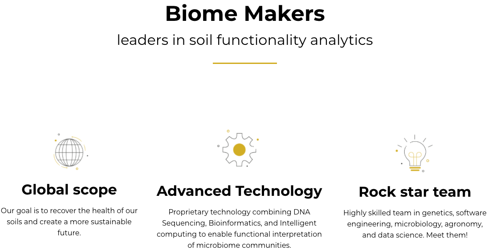
```
<br>
.marco[.tada[https://biomemakers.com]]
]

???

.h202[
- Our technological platform helps farmers and agronomists to discover the whole microbial community impacting your crop. From there, we can help to determine how to improve production and maintain soil sustainability for many future harvests to come.
]

---

background-image: url(images/bm2.jpg)
background-size: cover

.content-box-grey2[
.p20[
**2015**<br>
Biome Markers is born in San Francisco, taking action to recover soil health through technology
]
]
<br>
.content-box-grey2[
.p20[
**2016**<br>
Tails and market validation for advance soil analysis in vineyard
]
]
<br>
.content-box-grey2[
.p20[
**2017**<br>
Lauched the operational portal with all the features to be an easy and friendly platform
]
]
<br>
.content-box-grey2[
.p20[
**Community recognition**<br>
Many awards for providing the best technology for any crop and soil analysis
]
]
<br>
.content-box-grey2[
.p20[
**2018**<br>
Launch BeCrop and Gheom platforms (even on mobile) 
]
]
<br>


---

```{r echo=FALSE, out.width="800px"}
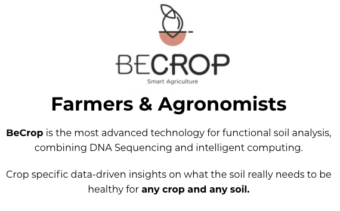
```

---

```{r echo=FALSE, out.width="1200px"}
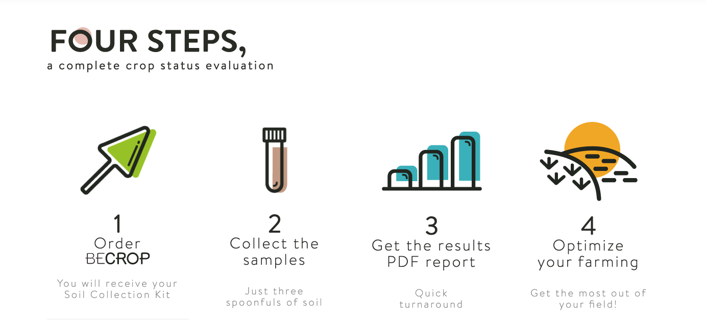
```

---

```{r echo=FALSE, out.width="1200px"}
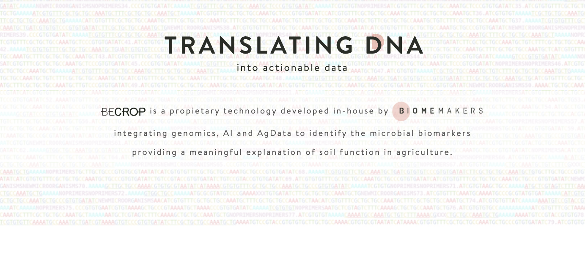
```

---

```{r echo=FALSE, out.width="1200px"}

```

---

```{r echo=FALSE, out.width="800px"}
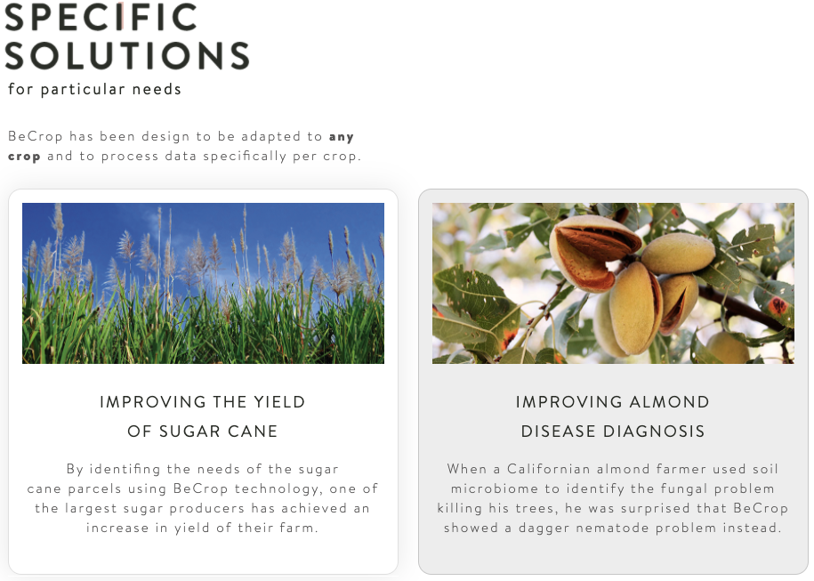
```
---

layout: true

# Questions about the lesson


---


.m0tbp[
.center[.font50px[`r fontawesome::fa("question-circle", fill = "black")`]]
]

.marco[
.center[.font90[[[`r fontawesome::fa("slack", fill = "steelblue")`](https://join.slack.com/t/ipma-2020/shared_invite/zt-j9o8ig7k-LN1~U3d6QJztquYbC6iW7w) Slack - `r fontawesome::fa("envelope", fill = "steelblue")`](mailto:marco.chiapello@unito.it) marco.chiapello@unito.it]
]
]

---

class: center, middle, clear

```{r echo=FALSE, out.width="400px"}

```

.m0tbp[https://bit.ly/2ZAYzkv]


