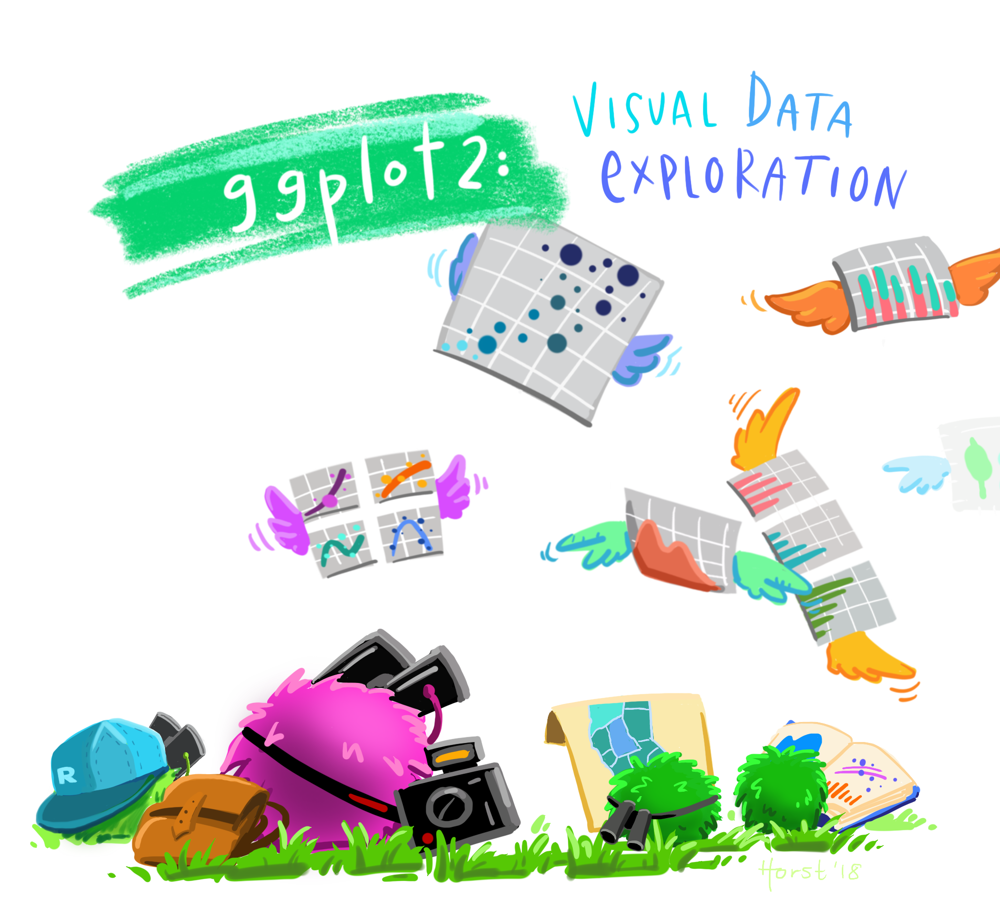

```{r setup, include=FALSE}
options(htmltools.dir.version = FALSE)
knitr::opts_chunk$set(
  fig.width=9, fig.height=3.5, fig.retina=3,
  out.width = "100%",
  cache = FALSE,
  echo = FALSE,
  message = FALSE, 
  warning = FALSE,
  fig.show = TRUE,
  hiline = TRUE
)
```

```{r xaringan-themer, include=FALSE, warning=FALSE}
library(xaringanthemer)
style_duo_accent(
  primary_color = "#1381B0",
  secondary_color = "#FF961C",
  inverse_header_color = "#FFFFFF",
  padding = "1px 64px 16px 64px",
  base_font_size = "30px",
  header_font_google = google_font("Josefin Slab", "600"),
  text_font_google = google_font("Roboto", "300"),
  text_slide_number_font_size = "0px",
  extra_fonts = list(
    google_font("Sofia"),
    # Young Serif by uplaod.fr
    "https://cdn.jsdelivr.net/gh/uplaod/YoungSerif/fonts/webfonts/fontface.css"
  ),
  extra_css = list(
    ".marco" = list("font-family" = "Sofia"),
    ".fl img" = list(float = "right"),
    ".fl p" = list(float = "right"),
    ".content-box" = list(
        "border-radius" = "15px",
        "overflow" = "hidden",
        "display" = "block",
        "text-align" = "center",
        "padding" = "2px",
	      "background-color" = "#FF961C",
        "margin" = "15px"),
    ".f60" = list("font-size" = "60px"),
    ".f20" = list("font-size" = "20px"),
    ".f40" = list("font-size" = "40px"),
    ".center" = list(
      margin = "auto",
      width = "50%",
      padding = "10px"),
    ".list1 p, .list1 ul li, .list1 ol li" = list(
      "line-height" = "27px",
      "font-size" = "25px",
      "margin" = "10px"),
    ".list2 p, .list1 ul li, .list1 ol li" = list(
      "line-height" = "23px",
      "font-size" = "20px",
      "margin" = "0px"),
    ".m5h4 h4" = list("margin" = "5px"),
    ".m5p p" = list("margin" = "5px")
  )
)

library(xaringanExtra)
use_tile_view() 
xaringanExtra::use_logo(
  image_url = "https://raw.githubusercontent.com/rstudio/hex-stickers/master/PNG/xaringan.png"
)
use_search(show_icon = FALSE)
use_panelset()
```

class: center middle inverse

## Corso base di R 

```{r out.width="95%"}

```

.list2[
.white[.f20[Istituto per la Protezione Sostenibile delle Piante]]   
.white[.f20[Consiglio Nazionale per le Ricerche]]
]

---

## About the teacher

.pull-left[

- Marco Chiapello, PhD

- Plant Biologist `r fontawesome::fa("seedling", fill = "#25403B")`

- Bioinformatician `r fontawesome::fa("laptop", fill = "black")`

- R addicted `r fontawesome::fa("registered", fill = "black")`

- Deeply in love with teaching `r fontawesome::fa("chalkboard-teacher", fill = "black")`
]

.pull-right[
.fl[
```{r out.width="60%"}
knitr::include_graphics("images/MC_bn.JPEG")
```
]
]

---

## Obiettivi del corso

.panelset[

.panel[.panel-name[Obiettivo 1]
<br><br>
.content-box[.f60[dare a tutti i partecipanti le competenze necessarie per utilizzare R]]

]

.panel[.panel-name[Obiettivo 2]
<br><br>
.content-box[.f60[importare, manipolare e trasformare tabelle di dati]]

]

.panel[.panel-name[Obiettivo 3]

<br><br>
.content-box[.f60[creare tabelle riassuntive]]

]

.panel[.panel-name[Obiettivo 4]

<br><br>
.content-box[.f60[creare visualizzazioni grafiche]]

]
]

---

## Pre-requisiti

<br>

.content-box[
.f60[`r anicon::nia("NESSUNO", animate="pulse")`]
]

---

## Struttura del corso 

.pull-left[
```{r out.width="100%"}

```

.f20[https://2021-09-cnr-r-base.github.io/2021-CNR-Rbasic/]

]


.pull-right[
.m5h4[
.list1[
#### Lezioni

- Teoriche    `r fontawesome::fa("youtube", fill = "#FF961C")`
    
- Pratiche  `r fontawesome::fa("chalkboard-teacher", fill = "#FF961C")`

#### Formative assessment

- Personale
        
    - Questionari
    - Esercizi 
    
- Da parte del docente

    - Sessioni di QA
    - Esercizi guidati
]
]
]

---

## Syllabus

.pull-left[
Il corso prevede 6 moduli: 

1. Introduzione a R e RStudio

1. Concetti fondamentali di R

1. Importazione/esportazione di dati

1. Utilizzo delle funzioni in R

1. Trasformazione dei dati

1. Esplorazione grafica dei dati
]

---

## Syllabus

.pull-left[
Il corso prevede 6 moduli: 

1. **Introduzione a R e RStudio**

1. Concetti fondamentali di R

1. Importazione/esportazione di dati

1. Utilizzo delle funzioni in R

1. Trasformazione dei dati

1. Esplorazione grafica dei dati
]

.pull-right[
```{r out.width="100%"}

```
]

---

## Syllabus

.pull-left[
Il corso prevede 6 moduli: 

1. Introduzione a R e RStudio

1. **Concetti fondamentali di R**

1. Importazione/esportazione di dati

1. Utilizzo delle funzioni in R

1. Trasformazione dei dati

1. Esplorazione grafica dei dati
]

.pull-right[
```{r out.width="100%"}
knitr::include_graphics("images/r_rollercoaster.png")
```
]

---

## Syllabus

.pull-left[
Il corso prevede 6 moduli: 

1. Introduzione a R e RStudio

1. Concetti fondamentali di R

1. **Importazione/esportazione di dati**

1. Utilizzo delle funzioni in R

1. Trasformazione dei dati

1. Esplorazione grafica dei dati
]

.pull-right[
```{r out.width="100%"}
knitr::include_graphics("images/dplyr_relocate.png")
```
]

---

## Syllabus

.pull-left[
Il corso prevede 6 moduli: 

1. Introduzione a R e RStudio

1. Concetti fondamentali di R

1. Importazione/esportazione di dati

1. **Utilizzo delle funzioni in R**

1. Trasformazione dei dati

1. Esplorazione grafica dei dati
]

.pull-right[
```{r out.width="100%"}
knitr::include_graphics("images/dplyr_filter.jpg")
```
]

---

## Syllabus

.pull-left[
Il corso prevede 6 moduli: 

1. Introduzione a R e RStudio

1. Concetti fondamentali di R

1. Importazione/esportazione di dati

1. Utilizzo delle funzioni in R

1. **Trasformazione dei dati**

1. Esplorazione grafica dei dati
]

.pull-right[
```{r out.width="80%"}
knitr::include_graphics("images/tidyr_spread_gather.png")
```
]

---

## Syllabus

.pull-left[
Il corso prevede 6 moduli: 

1. Introduzione a R e RStudio

1. Concetti fondamentali di R

1. Importazione/esportazione di dati

1. Utilizzo delle funzioni in R

1. Trasformazione dei dati

1. **Esplorazione grafica dei dati**
]

.pull-right[
```{r out.width="100%"}

```
]

---

## Come prepararsi al corso

<br>

1. Installare i Software necessari `r fontawesome::fa("laptop-code", fill = "#FF961C")`
    - Video illustrativo presente sul sito del corso
    
1. Possibile soluzione alternativa (RStudio Cloud) `r fontawesome::fa("cloud-upload-alt", fill = "#FF961C")`

---

## Codice di condotta

.pull-left[
.m5p[
.list1[
- Ci impegniamo a fornire un **ambiente accogliente e solidale** per tutte le persone, indipendentemente dal background o dall’identità.    
- Qualsiasi forma di comportamento per **escludere, intimidire o causare disagio costituisce una violazione** del CdC.       
- Al fine di promuovere un **ambiente di apprendimento positivo** e professionale, incoraggiamo i seguenti tipi di comportamenti:

]
]
]

.pull-right[
.m5p[
.list1[

- Usa un linguaggio accogliente e inclusivo

- Sii rispettoso dei diversi punti di vista

- Accetta con garbo le critiche costruttive

- Concentrati su ciò che è meglio per la classe

- Mostra cortesia e rispetto verso gli altri membri della classe
]
]
]

---

## Codice di condotta

.pull-left[
.m5p[
.list1[
- Ci impegniamo a fornire un **ambiente accogliente e solidale** per tutte le persone, indipendentemente dal background o dall’identità.    
- Qualsiasi forma di comportamento per **escludere, intimidire o causare disagio costituisce una violazione** del CdC.       
- Al fine di promuovere un **ambiente di apprendimento positivo** e professionale, incoraggiamo i seguenti tipi di comportamenti:

]
]
]

.pull-right[
.m5p[
.list1[

- Usa un linguaggio accogliente e inclusivo

- Sii rispettoso dei diversi punti di vista

- Accetta con garbo le critiche costruttive

- Concentrati su ciò che è meglio per la classe

- Mostra cortesia e rispetto verso gli altri membri della classe
]
]
]

.content-box[Partecipando a questa comunità,    
i **partecipanti accettano di rispettare il Codice di Condotta** (CdC).]

---
class: middle center

## Licenza del corso
.center[Apache License Version 2.0]
```{r out.width="100%"}

```

